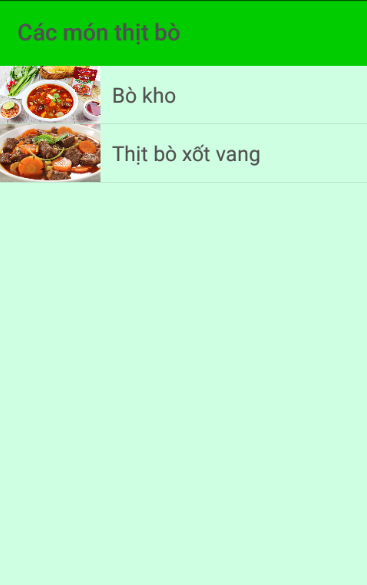
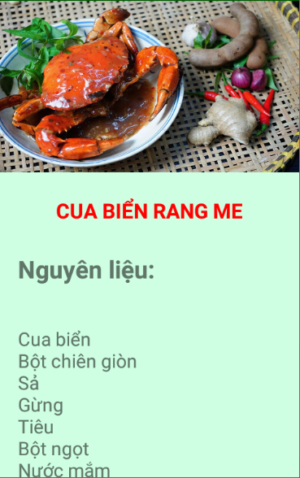

 Công thức nấu ăn
=================

Các thành viên:
------------

- Nguyễn Hoàng Phúc  : Phần xem Chi tiết món ăn (Activity, Layout, Adapter, Fragment, Hình ảnh chi tiết, sưu tầm công thức nguyên liệu) + Tạo và thiết kế Database.
- Nguyễn Thanh Phong : Trang chủ danh sách loại món ăn( Acitvity + Layout + Adapter + Fragment ).
- Nguyễn Hoàng Minh Phúc : các class hỗ trợ hình ảnh, database...: MyImageView + HelperDatabase  + FileUtil.
- Lê Nhật Phi : Trang danh sách món ăn trong từng loại ( Activity + Layout + Adapter + Fragment ).

Mô tả:
---------------
* Trang chủ hiển thị danh sách các loại món ăn phổ biến.
 * Trong mỗi loại chứa các món ăn của loại đó.
 * Phần chi tiết món ăn bao gồm : hình ảnh minh họa, nguyên liệu và cách làm.

Ảnh chụp màn hình
-----------

License
-------

Copyright 2020 Nhóm 15 App Công thức nấu ăn.

Hình ảnh, nguyên liệu và công thức được sao chép từ:

  https://www.cooky.vn/

